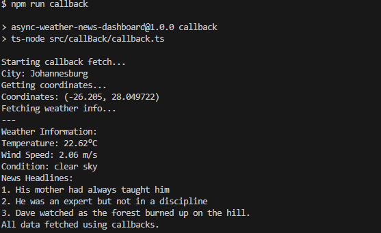
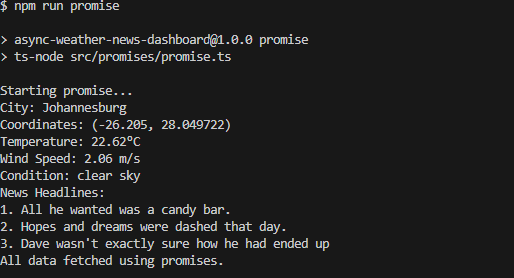
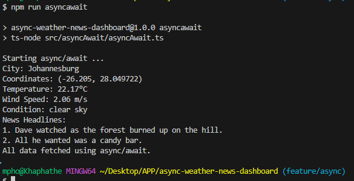

Async-weather-news-dashboard

A modular Node.js + TypeScript dashboard that fetches live weather and news headlines based on the user's location. Built to demonstrate and compare three asynchronous programming styles: callbacks, promises, and async/await.

----------------------

## Features

- Auto-detects user location via IP
- Fetches current weather using OpenWeatherMap
- Pulls top news headlines using DummyJSON
- Supports three async styles:
  - callback
  - promise
  - async/await 
- Modular httpHelper  implementations for each style

--------------------------

---

## Setup

1.Clone the repo:
   (bash)
   git clone https://github.com/khaphathe/async-weather-news-dashboard.git
   cd async-weather-news-dashboard

2.Install dependencies:
-npm install
3.Add your OpenWeatherMap API key:
-Replace WEATHER_API_KEY in all .ts files with your actual key.

## Scripts
 -npm run callback      
 -npm run promise       
 -npm run asyncawait 

## ScreenShorts

 ## A Note of Thanks
To everyone who’s taken the time to explore this project,Thank you.

Whether you’re here to learn, contribute, or just browse, your curiosity and attention mean a lot. This dashboard was built not just to fetch data, but to showcase the beauty of clean architecture, modular thinking, and the power of asynchronous code in action.
